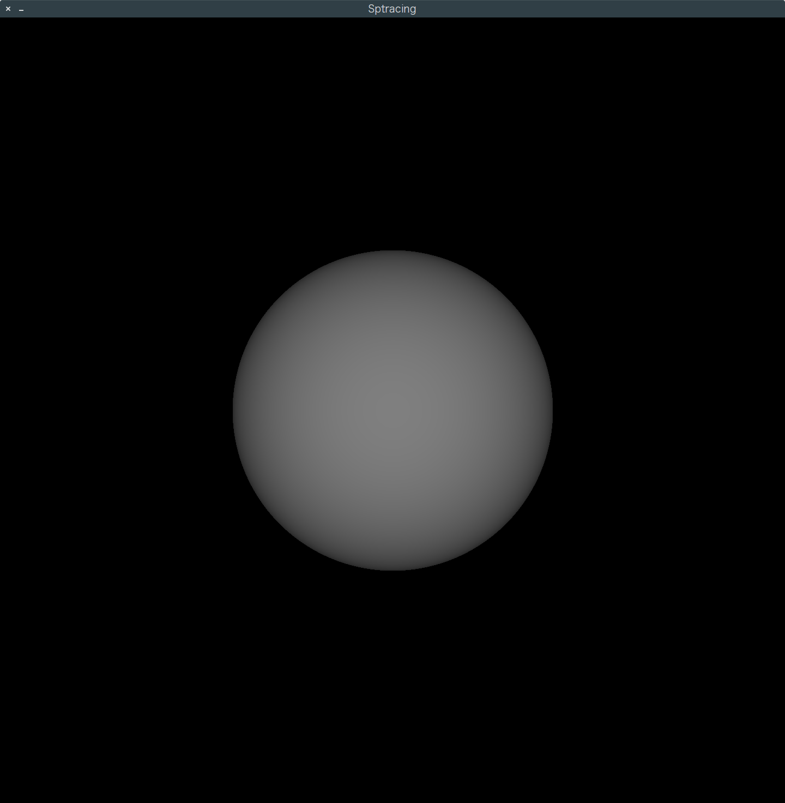

# Sptracing

depth rendering   
reflection   
directional light   
point light light   
spot light   
material demo 

## Rendering result(Depth)


## Install SDL2

### Linux & macOS

- Download `SDL2` from [here](https://www.libsdl.org/release/SDL2-2.0.5.tar.gz).

- Unzip to `./SDL2-2.0.5` 

- Install

  ```bash
  cd SDL2-2.0.5
  make
  make install
  ```

## Windows

#### Download

- Download `SDL2` from [here](https://www.libsdl.org/release/SDL2-devel-2.0.5-VC.zip).
- Unzip to `./SDL2-2.0.5`

#### Copy .dll files

There two ways to copy `.dll` files:

##### In the project directroy

- copy the x86 file to `./debug/x86`
- copy the x64 file to `./debug/x64`

In system dirctories

- x86: `C:/Windows/system32`
- x64: `C:/Windows/SysWOW64`

Then you can run it on Visual Studio 2017